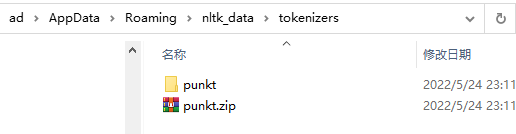

# 前言

---


## 1 准备工作

### 1.1 硬件要求

| **CPU**  | **双核**                                                   |
| :------: | ---------------------------------------------------------- |
| **设备** | **带 `Windows` / `Linux` / `macOS` 的 `PC` 或 `Mac` 均可** |
| **内存** | **4 GB**                                                   |
| **磁盘** | **10 GB+ 可用空间**                                        |


### 1.2 软件要求

|    **操作系统**    | **Windows 7 SP1 32/64-bit, <br/>Windows 8.1 32/64-bit<br/>Windows10 32/64-bit, <br/>Ubuntu 14.04 or later, <br/>macOS Sierra or later** |
| :----------------: | ------------------------------------------------------------ |
|     **浏览器**     | `Google Chrome` / `Mozilla Firefox`                          |
| **`Python` 工具1** | `Anaconda`                                                   |
| **`Python` 工具2** | `Jupyter Notebook`                                           |
| **`Python` 工具3** | `Python 3.x`                                                 |


### 1.3 安装与设置

- 安装 `Python 3.6`（实际 `3.10.0`）
- 安装 `pip`
- 安装工具包：`python -m pip install --user numpy scipy matplotlib pandas scikit-learn nltk`
- 设置国内镜像：`pip config set global.index-url https://pypi.tuna.tsinghua.edu.cn/simple`


### 1.4 源代码下载

`GitHub` 仓库地址：https://github.com/TrainingByPackt/Natural-Language-Processing-Fundamentals

本地 `Fork` 版：https://github.com/SafeWinter/packt-nlp-fundamentals

由于源代码较大，不建议使用 `Git` 管理，直接下载 `zip` 包即可。


### 1.5 引入相关包

- 引入 `numpy` 包：`import numpy`
- 引入包后重命名：`import numpy as np`
- 引入包中的某个方法：`from numpy import mean`
- 手动下载第三方工具包官方地址：`https://www.nltk.org/data.html`
- 手动下载 `NLTK` 相关工具包主页：`https://www.nltk.org/nltk_data/`


### 1.6 安装代码库

类的源代码统一放入本地路径 `C:/Code` 下。


### 1.7 启动 `Jupyter Notebook`

管理员身份启动 `Anaconda Promt (anaconda3)`，进入指定目录后，运行 `jupyter lab` 即可。


## 2 调试备忘录

### 2.1 安装模块 `punkt` 报错

在 `VSCode` 下运行第一章练习 2 中的第三段代码报错：

```python
words = word_tokenize("I am reading NLP Fundamentals")
print(words)
```

报错信息：

```markdown
---------------------------------------------------------------------------
LookupError                               Traceback (most recent call last)
~\AppData\Local\Temp/ipykernel_20272/2062650012.py in <module>
----> 1 words = word_tokenize("I am reading NLP Fundamentals")
      2 print(words)

c:\Users\ad\anaconda3\lib\site-packages\nltk\tokenize\__init__.py in word_tokenize(text, language, preserve_line)
    127     :type preserve_line: bool
    128     """
--> 129     sentences = [text] if preserve_line else sent_tokenize(text, language)
    130     return [
    131         token for sent in sentences for token in _treebank_word_tokenizer.tokenize(sent)

c:\Users\ad\anaconda3\lib\site-packages\nltk\tokenize\__init__.py in sent_tokenize(text, language)
    104     :param language: the model name in the Punkt corpus
    105     """
--> 106     tokenizer = load(f"tokenizers/punkt/{language}.pickle")
    107     return tokenizer.tokenize(text)
    108 

c:\Users\ad\anaconda3\lib\site-packages\nltk\data.py in load(resource_url, format, cache, verbose, logic_parser, fstruct_reader, encoding)
    748 
    749     # Load the resource.
--> 750     opened_resource = _open(resource_url)
    751 
    752     if format == "raw":

c:\Users\ad\anaconda3\lib\site-packages\nltk\data.py in _open(resource_url)
    874 
    875     if protocol is None or protocol.lower() == "nltk":
--> 876         return find(path_, path + [""]).open()
    877     elif protocol.lower() == "file":
    878         # urllib might not use mode='rb', so handle this one ourselves:

c:\Users\ad\anaconda3\lib\site-packages\nltk\data.py in find(resource_name, paths)
    581     sep = "*" * 70
    582     resource_not_found = f"\n{sep}\n{msg}\n{sep}\n"
--> 583     raise LookupError(resource_not_found)
    584 
    585 

LookupError: 
**********************************************************************
  Resource punkt not found.
  Please use the NLTK Downloader to obtain the resource:

  >>> import nltk
  >>> nltk.download('punkt')
  
  For more information see: https://www.nltk.org/data.html

  Attempted to load tokenizers/punkt/english.pickle

  Searched in:
    - 'C:\\Users\\ad/nltk_data'
    - 'c:\\Users\\ad\\anaconda3\\nltk_data'
    - 'c:\\Users\\ad\\anaconda3\\share\\nltk_data'
    - 'c:\\Users\\ad\\anaconda3\\lib\\nltk_data'
    - 'C:\\Users\\ad\\AppData\\Roaming\\nltk_data'
    - 'C:\\nltk_data'
    - 'D:\\nltk_data'
    - 'E:\\nltk_data'
    - ''
**********************************************************************
```

报错原因：`nltk` 中的 `punkt` 工具包未安装到本地。

解决方案：（自动下载安装速度较慢，不可擅自中断操作）

```python
# Windows Terminal 命令行环境下进入 Python 交互式命令行环境
> python
Python 3.10.0 (tags/v3.10.0:b494f59, Oct  4 2021, 19:00:18) [MSC v.1929 64 bit (AMD64)] on win32
Type "help", "copyright", "credits" or "license" for more information.
>>> import nltk
>>> nltk.download('punkt')
[nltk_data] Downloading package punkt to
[nltk_data]     C:\Users\ad\AppData\Roaming\nltk_data...
[nltk_data]   Unzipping tokenizers\punkt.zip.
True
>>> exit() # 退出 Python 环境
```

手动安装方法：

到 `nltk` [官网](https://www.nltk.org/data.html) 手动下载所需依赖包。该问题所需 `punkt` 下载地址，需访问 https://www.nltk.org/nltk_data/ 后搜索 `punkt` 即可看到。再将下载好的 `zip` 压缩包手动复制到 `C:\Users\ad\AppData\Roaming\nltk_data` 文件夹下，解压到当前目录即可：




### 2.2 模块 `autocorrect` 未找到

运行第一章 `Lesson1\Activity1.ipynb` 的第一段代码，第 9 行报错：`autocorrect` 无法解析为一个模块。于是手动运行 `python -m pip install --user autocorrect ` 进行安装，根据提示，还手动安装了 `wheel` 模块（安装语句同上）。

但是 `VSCode` 模式下始终无法识别。

后来发现，安装路径在 `Python3.10` 下，而 `VSCode` 默认运行代码的内核版本为 `Python3.9`（即 `anaconda` 使用的 `Python` 版本）。于是从 `VSCode` 切换 `Kernel` 版本至 `3.10`，运行成功。


### 2.3 `autocorrect.spell` 过时的问题

执行到？第四段代码时，出现意外结果：

```markdown
Output exceeds the size limit. Open the full output data in a text editor
autocorrect.spell is deprecated,             use autocorrect.Speller instead
autocorrect.spell is deprecated,             use autocorrect.Speller instead
autocorrect.spell is deprecated,             use autocorrect.Speller instead
autocorrect.spell is deprecated,             use autocorrect.Speller instead
autocorrect.spell is deprecated,             use autocorrect.Speller instead
autocorrect.spell is deprecated,             use autocorrect.Speller instead
Sohom has been corrected to: Show
autocorrect.spell is deprecated,             use autocorrect.Speller instead
Ghosh has been corrected to: Ghost
autocorrect.spell is deprecated,             use autocorrect.Speller instead
autocorrect.spell is deprecated,             use autocorrect.Speller instead
Dwight has been corrected to: Right
autocorrect.spell is deprecated,             use autocorrect.Speller instead
Gunning has been corrected to: Running
autocorrect.spell is deprecated,             use autocorrect.Speller instead
autocorrect.spell is deprecated,             use autocorrect.Speller instead
autocorrect.spell is deprecated,             use autocorrect.Speller instead
learnning has been corrected to: learning
autocorrect.spell is deprecated,             use autocorrect.Speller instead
autocorrect.spell is deprecated,             use autocorrect.Speller instead
autocorrect.spell is deprecated,             use autocorrect.Speller instead
pracess has been corrected to: process
autocorrect.spell is deprecated,             use autocorrect.Speller instead
Natueral has been corrected to: Natural
autocorrect.spell is deprecated,             use autocorrect.Speller instead
...
autocorrect.spell is deprecated,             use autocorrect.Speller instead
autocorrect.spell is deprecated,             use autocorrect.Speller instead
autocorrect.spell is deprecated,             use autocorrect.Speller instead
autocorrect.spell is deprecated,             use autocorrect.Speller instead
```

原来，`spell` 方法目前已过时，取而代之的是 `Speller`，更正如下：

```python
from autocorrect import Speller
# ...
corrected_sentence = ""
corrected_word_list = []
for wd in words:
    if wd not in string.punctuation:
        #wd_c = spell(wd)
        corr = Speller() # use Speller in place of original spell method
        wd_c = corr.autocorrect_word(wd)  # use new autocorrect_word method
        if wd_c != wd:
            print(wd+" has been corrected to: "+wd_c)
            corrected_sentence = corrected_sentence+" "+wd_c
            corrected_word_list.append(wd_c)
        else:
            corrected_sentence = corrected_sentence+" "+wd
            corrected_word_list.append(wd)
    else:
        corrected_sentence = corrected_sentence + wd
        corrected_word_list.append(wd)
```

最终执行结果：

```markdown
Sohom has been corrected to: Show
Ghosh has been corrected to: Ghost
Dwight has been corrected to: Right
Gunning has been corrected to: Running
learnning has been corrected to: learning
pracess has been corrected to: process
Natueral has been corrected to: Natural
NLP has been corrected to: LP
NLP has been corrected to: LP
prajects has been corrected to: projects
```


### 2.4 手动安装模块 `omw-1.4`

继续执行 `Lesson1\Activity1.ipynb` 的后续代码，报错：缺少模块 `omw-1.4`。由于交互式命令行环境下自动下载工具包太慢，于是访问 `nltk` 官方主页，查找 `omw-1.4` 并下载 `zip` 压缩包到 `{user_name}\AppData\Roaming\nltk_data\corpora\` 下，然后解压到当前文件夹。最后运行代码，全部通过。
