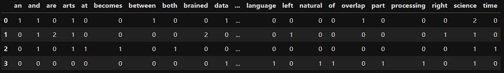
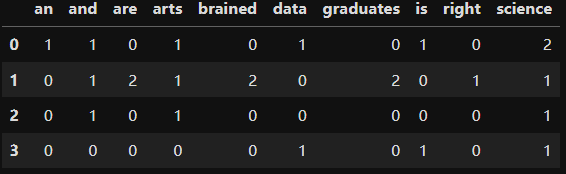
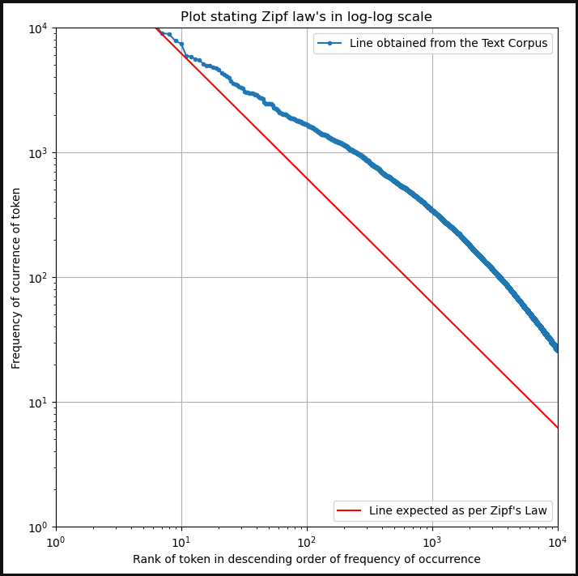
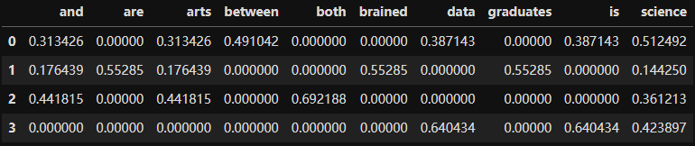

## Ch02.4 Feature Extraction from Texts


### 1 概念

特征提取旨在从文本中提取能唯一表征文本的属性，这些属性即为特征。

机器学习算法仅接受 **数值特征** 作为输入。因此，将文本转化为数值特征至关重要。


### 2 分类

文本特征的分类：

- 通用特征：不受构成文本的单个词元直接影响的特征，称为通用特征（如文本所用语言、总词数等）
- 特定特征：包括 **词袋模型** 和 **TF-IDF** 文本表示法


### 3 提取通用特征实战

（详见第二章 `Exercise 22.ipynb`）

本节通过批量处理五个英文句子，依次分别提取如下通用特征（均与每句话的具体词元无关）：

1. 单词总数
2. 检测是否存在以 `wh` 开头的词
3. 情绪极性
4. 情感主体性
5. 所用的语言

```python
import pandas as pd
df = pd.DataFrame([['The interim budget for 2019 will be announced on 1st February.'],
                   ['Do you know how much expectation the middle-class working population is having from this budget?'],
                   ['February is the shortest month in a year.'],
                   ['This financial year will end on 31st March.']])
df.columns = ['text']

#Q1 Solution
from textblob import TextBlob
df['number_of_words'] = df['text'].apply(lambda x : len(TextBlob(str(x)).words))
df['number_of_words']

#Q2 Solution
wh_words = set(['why', 'who', 'which', 'what', 'where', 'when', 'how'])
df['is_wh_words_present'] = df['text'].apply(lambda x : len(set(TextBlob(str(x)).words).intersection(wh_words)))
df['is_wh_words_present']

#Q3 Solution
df['polarity'] = df['text'].apply(lambda x : TextBlob(str(x)).sentiment.polarity)
df['polarity']

#Q4 Solution
df['subjectivity'] = df['text'].apply(lambda x : TextBlob(str(x)).sentiment.subjectivity)
df['subjectivity']

#Q5 Solution
# 由于 Google 翻译免费 API 已失效，实测时报 400 请求错误。
# df['language'] = df['text'].apply(lambda x : TextBlob(str(x)).detect_language())
# 根据 DeepSeek 提示换用 langdetect 模块的 detect 方法
from langdetect import detect
df['language'] = df['text'].apply(lambda x: detect(str(x)))
df['language']
```

为了加深印象，书中还列举了其他通用特征（详见 `Activity2.ipynb`）：

i) 每种词性出现的次数；
ii) 每句话标点符号的数量；
iii) 分别计算大/小写单词的数量；
iv) 字母的总数
v) 数字的总次数
vi) 总单词数
vii) 每句话的空白符总数


### 4 词袋模型 BoW

一堆语料出现过的所有词汇，构成词袋模型的字段列；其行则是每句话的统计结果：统计该句子在对应的单词中出现的次数：



用到的主要代码如下：

```python
import pandas as pd
from sklearn.feature_extraction.text import CountVectorizer
corpus = [
    'Data Science is an overlap between Arts and Science',
    'Generally, Arts graduates are right-brained and Science graduates are left-brained',
    'Excelling in both Arts and Science at a time becomes difficult',
    'Natural Language Processing is a part of Data Science'
]

bag_of_words_model = CountVectorizer()
bag_of_word_df = pd.DataFrame(bag_of_words_model.fit_transform(corpus).todense())
bag_of_word_df.columns = sorted(bag_of_words_model.vocabulary_)
bag_of_word_df.head()
```

此外，还可以对列字段的数量进行限定（例如最多提取 10 个 **特征**）：

```python
##Q2 Solution : Bag of word model for top 10 frequent terms
bag_of_words_model_small = CountVectorizer(max_features=10)
bag_of_word_df_small = pd.DataFrame(bag_of_words_model_small.fit_transform(corpus).todense())
bag_of_word_df_small.columns = sorted(bag_of_words_model_small.vocabulary_)
bag_of_word_df_small.head()
```

实测结果如下：




### 5 齐普夫定律

定律内容：对于给定的自然语言语料库，任何单词的出现频率与其在频率表中的排名成反比。

本节语料库来自 `SciKitLearn` 的 20 个新闻组文本数据集（详见 `Exercise24.ipynb`）

实测验证结果如下：



实测代码时发现绘制逻辑少了一句最关键的 `plt.show()`，导致图像无法显示。


### 6 TF-IDF

`TF-IDF` 指标是为了弥补 `BoW` 词袋模型存在的严重缺陷：词频并不总能反映某词汇在文档中承载的实际信息量。

**TF-IDF（Term Frequency - Inverse Document Frequency，词频-逆文档频率）** 将文本数据用矩阵的形式展示出来，第 `i` 行表示某个特定文档（document），第 `j` 列表示词汇表中的某个单词，数值即为该单词在该文档的词频逆文档频率。

第 j 列词元在第 i 行文档中的词频，本来定义为 j 在 i 中出现的次数，但由于越少见的单词信息量往往更丰富，因此需要加权处理，权重即 `IDF` 逆文档频率，具体计算公式如下：

$$\text{term j } (idf_j) = \log_{10} \left( \frac{1}{df_j/N} \right)$$

其中，右边的分母为包含词元 `j` 的文档频率（包含的文档数比总的文档数），取倒数后又取 10 的对数进行修正，更能反映 `TF-IDF` 的数值特征。

关键代码：

```python
import pandas as pd
from sklearn.feature_extraction.text import TfidfVectorizer
corpus = [
    'Data Science is an overlap between Arts and Science',
    'Generally, Arts graduates are right-brained and Science graduates are left-brained',
    'Excelling in both Arts and Science at a time becomes difficult',
    'Natural Language Processing is a part of Data Science'
]

tfidf_model_small = TfidfVectorizer(max_features=10)
tfidf_df_small = pd.DataFrame(tfidf_model_small.fit_transform(corpus).todense())
tfidf_df_small.columns = sorted(tfidf_model_small.vocabulary_)
tfidf_df_small.head()
```

实测结果：



此外，在 `Activity3.ipynb` 中，作者更是通过对同一语料库分别做 `BoW` 建模和 `TF-IDF` 矩阵（同时提取最有代表的 20 个特征），最终得出 `TF-IDF` 确认的最大词频更有说服力（消除了词频越大权重越大的干扰）。
