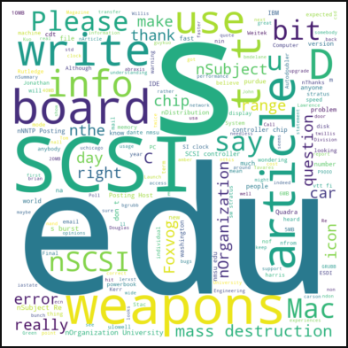
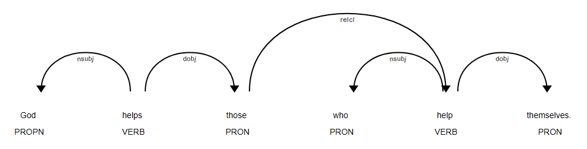
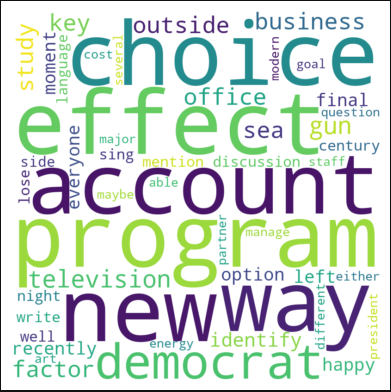

## Ch02.5 Feature Engineering 特征工程


### 1 相关概念

特征工程是一种从现有特征中提取新特征的方法。

新特征之所以被提取，是因为它们往往能有效解释数据中的变异性。

特征工程的一个应用场景，是计算不同文本片段之间的 **相似度**。

计算两段文本相似度的方法多种多样，其中最常用的方法是 **余弦相似度** 和 `Jaccard` 相似度。


余弦相似度：两个文本之间的余弦相似度，是其向量表示之间夹角的余弦值。词袋模型（BoW）和词频-逆文档频率（TF-IDF）矩阵可视为 **文本的向量表示**。

`Jaccard` 相似度：是两个文本文件中 **共享术语量** 与这些文本中所有独特术语总数之比。


### 2 特征工程实战

准备工作：

```python
from nltk import word_tokenize
from nltk.stem import WordNetLemmatizer
from sklearn.feature_extraction.text import TfidfVectorizer
from sklearn.metrics.pairwise import cosine_similarity
lemmatizer = WordNetLemmatizer()

pair1 = ["What you do defines you","Your deeds define you"]
pair2 = ["Once upon a time there lived a king.", "Who is your queen?"]
pair3 = ["He is desperate", "Is he not desperate?"]
```

自定义 `Jaccard` 相似度计算函数并实测：

```python
def extract_text_similarity_jaccard (text1, text2):
    words_text1 = [lemmatizer.lemmatize(word.lower()) for word in word_tokenize(text1)]
    words_text2 = [lemmatizer.lemmatize(word.lower()) for word in word_tokenize(text2)]
    nr = len(set(words_text1).intersection(set(words_text2)))
    dr = len(set(words_text1).union(set(words_text2)))
    jaccard_sim = nr/dr
    return jaccard_sim

extract_text_similarity_jaccard(pair1[0],pair1[1])
# 0.14285714285714285
extract_text_similarity_jaccard(pair2[0],pair2[1])
0.0
extract_text_similarity_jaccard(pair3[0],pair3[1])
0.6
```

再来计算余弦相似度：

```python
tfidf_model = TfidfVectorizer()

#Creating a corpus which will have texts of pair1, pair2 and pair 3 respectively
corpus = [pair1[0], pair1[1], pair2[0], pair2[1], pair3[0], pair3[1]]

tfidf_results = tfidf_model.fit_transform(corpus)
#Note: Here tfidf_results will have tf-idf representation of texts of pair1, pair2 and pair3 in the given order.
#Thus, tfidf_results[0],tfidf_results[1] represents pair1
#tfidf_results[2],tfidf_results[3] represents pair2
#tfidf_results[4],tfidf_results[5] represents pair3
```

实测发现，原第 6 行的写法已过时（`tfidf_results = tfidf_model.fit_transform(corpus).todense()`），最新的余弦相似度无需求取 `.todense()` 这一步，只需要两个稀疏向量即可：

```python
#cosine similarity between texts of pair1
cosine_similarity(tfidf_results[0],tfidf_results[1])
# array([[0.3082764]])

#cosine similarity between texts of pair2
cosine_similarity(tfidf_results[2],tfidf_results[3])
# array([[0.]])

#cosine similarity between texts of pair3
cosine_similarity(tfidf_results[4],tfidf_results[5])
# array([[0.80368547]])
```


### 3 文本可视化——词云

文本可视化的可选方案不多，常见的有词云法和依赖解析树法。

本节先演示词云法，需要先退出 `Jupyterlab`，安装必要的 `wordcloud` 模块：

```python
conda install -c conda-forge wordcloud
```

然后打开 `Exercise27.ipynb`，执行如下脚本：

```python
from wordcloud import WordCloud, STOPWORDS
import matplotlib.pyplot as plt
%matplotlib inline

from sklearn.datasets import fetch_20newsgroups
newsgroups_data_sample = fetch_20newsgroups(subset='train')

other_stopwords_to_remove = ['\\n', 'n', '\\', '>', 'nLines', 'nI',"n'"]
STOPWORDS = STOPWORDS.union(set(other_stopwords_to_remove))
stopwords = set(STOPWORDS)
text = str(newsgroups_data_sample['data'][:10])
wordcloud = WordCloud(width = 800, height = 800, 
                background_color ='white', 
                max_words=200,
                stopwords = stopwords, 
                min_font_size = 10).generate(text)
plt.imshow(wordcloud, interpolation='bilinear')
plt.axis("off")
plt.show()
```

实测结果：




### 4 文本可视化——依赖解析树

该方法多用于句子的可视化。通常，构成句子的短语之间存在相互依存关系。通过一种称为 **依赖解析树（dependency parse tree）** 的树状结构来描绘这些依存关系。

本节同样需要安装必要模块 `spaCy` 库：

```python
conda install -c conda-forge spacy
```

然后执行如下脚本：

```python
!python -m spacy download en
# Installing collected packages: en-core-web-sm
# Successfully installed en-core-web-sm-3.8.0
# [!] As of spaCy v3.0, shortcuts like 'en' are deprecated. Please use
# the full pipeline package name 'en_core_web_sm' instead.
# [+] Download and installation successful
# You can now load the package via spacy.load('en_core_web_sm')

import spacy
from spacy import displacy
import en_core_web_sm
nlp = en_core_web_sm.load()

doc = nlp('God helps those who help themselves.')
displacy.render(doc, style='dep', jupyter=True)
```

实测效果：



此时可以对语料中的命名实体进行可视化设计，标注不同的强调背景色：

```python
text = 'Once upon a time there lived a saint named Ramakrishna Paramahansa. \
        His chief disciple Narendranath Dutta also known as Swami Vivekananda \
        is the founder of Ramakrishna Mission and Ramakrishna Math.'
doc2 = nlp(text)
displacy.render(doc2, style='ent', jupyter=True)
```


最后，作者还在 `Activity4.ipynb` 中对词云法作了进一步巩固，为 50 个出现频率最高的词创建一组独特词汇及其频率统计，并最终绘它们的词云效果。实测效果如下：



