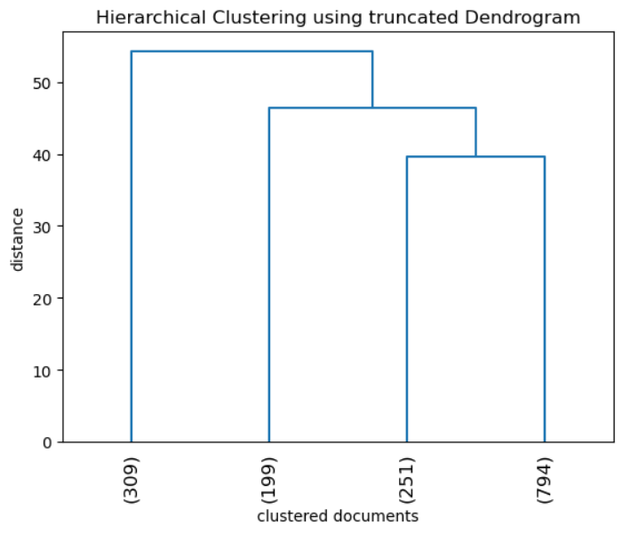
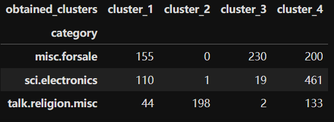
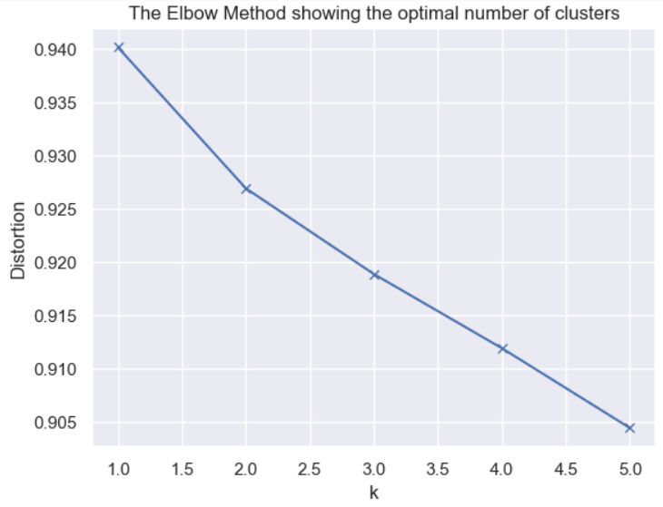
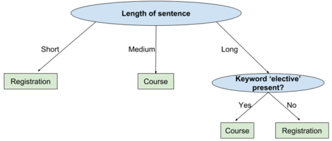
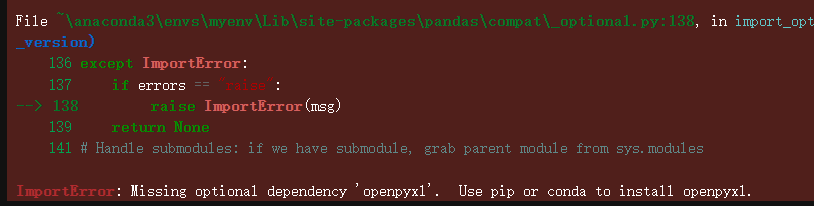

## Ch03.2 Machine Learning


### 3.2.1 相关概念

机器学习是指理解数据集中存在的模式的过程，使机器能够从任何给定数据中学习并产生相应结果，而无需显式编程。

其基本原理是向机器学习算法输入海量数据，使其进行处理并构建模型。

根据训练数据是否被提前标注，机器学习可进一步分为：**无监督学习（unsupervised learning）** 和 **监督学习（supervised learning）**。


### 3.2.2 无监督学习

无监督学习是一种算法在未标注数据中学习模式的方法。由于缺乏 **标签（监督者）**，故称为无监督学习。

在无监督学习中，只要给算法提供特征数据，算法便能自主从数据中学习模式。


无监督学习可进一步分为 **聚类（Clustering）** 和 **关联（Association）**：

- 聚类：在谷歌等搜索引擎中检索时，系统推荐的相似网页或链接正是基于文档聚类技术实现的
- 关联：典型的应用场景是识别顾客的购买模式。例如，在某家超市中，习惯购买牛奶和面包的顾客通常也会购买奶酪


#### 1 层次聚类

在层次聚类算法中，可根据需求调整聚类数量：首先构建一个矩阵，记录每对实例（数据点）之间的距离。随后采用 **聚合式（Agglomerative）**（自底向上）或 **分割式（Divisive）**（自顶向下）任一方法构建 **聚类树（dendrogram）**。

聚类树是以树形结构呈现聚类结果的可视化效果，其节点间距基于数据点间的距离计算。 我们将树形结构的叶子节点截断在指定的聚类数位置。

`Exercise29.ipynb`：层次聚类实战

该练习从 `sklearn` 模块获取原始文本数据，然后用三个已知的分类标签给数据集添加标注；接着对数据集进行数据清洗（正则替换、分词、词干提取），指定 200 个特征求解清洗后的数据集的 `TF-IDF` 词频，进而得到基于余弦相似度的距离矩阵；最后利用 `scipy.cluster.hierarchy` 模块提供的层次聚类函数 `ward` 和 `dendrogram` 绘制叶子节点数为 4 的聚类树。

核心代码：

```python
categories= ['misc.forsale', 'sci.electronics', 'talk.religion.misc']
news_data = fetch_20newsgroups(subset='train', categories=categories,\
                               shuffle=True, random_state=42, download_if_missing=True)
Counter(news_data.target)
# Counter({np.int64(1): 591, np.int64(0): 585, np.int64(2): 377})

news_data_df['cleaned_text'] = news_data_df['text'].apply(\
lambda x : ' '.join([lemmatizer.lemmatize(word.lower()) \
    for word in word_tokenize(re.sub(r'([^\s\w]|_)+', ' ', str(x))) if word.lower() not in stop_words]))

tfidf_model = TfidfVectorizer(max_features=200)
tfidf_df = pd.DataFrame(tfidf_model.fit_transform(news_data_df['cleaned_text']).todense())
tfidf_df.columns = sorted(tfidf_model.vocabulary_)

# 计算余弦相似度对应的距离
dist = 1 - cosine_similarity(tfidf_df)
linkage_matrix = ward(dist) 
linkage_matrix
'''array([[1.81000000e+02, 1.28300000e+03, 0.00000000e+00, 2.00000000e+00],
       [1.07900000e+03, 1.15200000e+03, 0.00000000e+00, 2.00000000e+00],
       [1.98000000e+02, 6.15000000e+02, 1.11022302e-16, 2.00000000e+00],
       ...,
       [3.09900000e+03, 3.10100000e+03, 3.96394713e+01, 1.04500000e+03],
       [3.10000000e+03, 3.10200000e+03, 4.64754315e+01, 1.24400000e+03],
       [3.09700000e+03, 3.10300000e+03, 5.42915778e+01, 1.55300000e+03]])'''

#Truncating the Dendogram Truncation to show last 4 clusters
plt.title('Hierarchical Clustering using truncated Dendrogram')
plt.xlabel('clustered documents')
plt.ylabel('distance')
dendrogram(
    linkage_matrix,
    truncate_mode='lastp',  # showing only last p clusters after merging
    p=4,  # p is the number of cluster that should remain after merging 
    leaf_rotation=90.,
    leaf_font_size=12.
    )
plt.show()
```

实测结果：




利用 `crosstab` 函数对比聚类后的分类标签与给定标签的匹配情况：

```python
#Let's create 4 cluster from the linkage matrix
k=4
clusters = fcluster(linkage_matrix, k, criterion='maxclust')
clusters
news_data_df['obtained_clusters'] = clusters
#Let's validate the cluster we have created with the actual categories
pd.crosstab(news_data_df['category'].replace({0:'misc.forsale', 1:'sci.electronics', 2:'talk.religion.misc'}),\
            news_data_df['obtained_clusters'].replace({1 : 'cluster_1', 2 : 'cluster_2', 3 : 'cluster_3', 4: 'cluster_4'}))
```

实测结果（似乎不太匹配）：




#### 2 K 均值聚类

该聚类分为两个阶段：分配阶段（assignment phase）和更新阶段（update phase）。

假设有 10 份文档。你希望根据它们的属性（如包含的单词数、段落数、标点符号等）将它们分为 3 类。此时 k 值为 3。首先需要选定 3 个聚类中心（均值）。 在初始化阶段，将 10 份文档分别分配至 3 个类别，形成 3 个初始集群。更新阶段则计算 3 个新集群的聚类中心。为确定最优集群数 k，需对不同 k 值执行 k 均值聚类，并记录其性能指标（均方误差）。 最终选择能使均方误差总和最低的 k 的最小值，该方法称为 **肘部法（the elbow method）**。

`Exercise30.ipynb` 实测 K 均值聚类时报错，需提前安装 `seaborn` 依赖：

```python
conda install -c conda-forge seaborn
```

核心脚本：

```python
tfidf_model = TfidfVectorizer(max_features=200)
tfidf_df = pd.DataFrame(tfidf_model.fit_transform(news_data_df['cleaned_text']).todense())
tfidf_df.columns = sorted(tfidf_model.vocabulary_)

kmeans = KMeans(n_clusters=4)
kmeans.fit(tfidf_df)
y_kmeans = kmeans.predict(tfidf_df)
news_data_df['obtained_clusters'] = y_kmeans

#Using Elbow method to obtain the number of clusters
distortions = []
K = range(1,6)
for k in K:
    kmeanModel = KMeans(n_clusters=k)
    kmeanModel.fit(tfidf_df)
    distortions.append(sum(np.min(cdist(tfidf_df, kmeanModel.cluster_centers_, 'euclidean'), axis=1)) / tfidf_df.shape[0])

# Plot the elbow
plt.plot(K, distortions, 'bx-')
plt.xlabel('k')
plt.ylabel('Distortion')
plt.title('The Elbow Method showing the optimal number of clusters')
plt.show()
#FROM THIS PLOT SELECT K WEHRE THE PLOT HAS STEEPEST SLOPE i.e. 2
```

实测结果：



可见，拐点位于 `k = 2` 位置，因此最优聚类数为 2。


### 3.2.5 监督学习

监督学习算法需要标注数据。监督学习通过分析所提供数据的各种特征，学习如何自动生成标签或预测值。典型场景：在手机中为重要短信添加星标，并希望实现每日自动筛选所有消息的任务（根据内容自动给新消息加星）。在此场景中，之前标记的星标消息可作为标注数据使用。基于这些数据，我们可以创建两种类型的模型：

1. 能够判断新消息是否重要（需要加星）
2. 能够预测新消息的重要性概率（需要加星的概率）

前者称为分类（classification），后者称为回归（regression）。


#### 1 三种分类分析方法

`Exercise31.ipynb` 介绍了三种常见的分类方法：

- 逻辑回归法
- 朴素贝叶斯法
- KNN 法（K-Nearest Neighbors）

练习过程分别演示了三种方法的训练过程和预测情况，标签 1 代表正面评价，标签 0 代表负面评价。真实分类与预测分类对比如下：

逻辑回归法：

| predicted_labels | 0    | 1    |
| ---------------- | ---- | ---- |
| target           |      |      |
| 0                | 1543 | 1780 |
| 1                | 626  | 6312 |

朴素贝叶斯法：

| predicted_labels_nb | 0    | 1    |
| ------------------- | ---- | ---- |
| target              |      |      |
| 0                   | 2333 | 990  |
| 1                   | 2380 | 4558 |

KNN 法：

| predicted_labels_knn | 0    | 1    |
| -------------------- | ---- | ---- |
| target               |      |      |
| 0                    | 2594 | 729  |
| 1                    | 375  | 6563 |

最理想的情况是仅对角线有值，反对角线为 0。


#### 2 回归分析法

典型场景：假设有若干人物照片及其年龄信息，需要根据照片预测其他人的年龄，这就是回归的应用场景。

在回归分析中，因变量（即本例中的年龄）是连续变量。自变量（即特征）由图像属性构成，例如每个像素的色彩强度。严格来说，回归分析是指学习映射函数的过程，该函数将特征或预测变量（输入）与因变量（输出）建立关联。

回归分析包含多种类型：单变量回归、多变量回归、简单回归、多元回归、线性回归、非线性回归、多项式回归、逐步回归、岭回归、Lasso 回归以及弹性网回归。

本节只演示线性回归（`Exercise32.ipynb`：基于文本数据的回归分析）。

关键脚本：

```python
tfidf_model = TfidfVectorizer(max_features=500)
tfidf_df = pd.DataFrame(tfidf_model.fit_transform(review_data['cleaned_review_text']).todense())
tfidf_df.columns = sorted(tfidf_model.vocabulary_)

from sklearn.linear_model import LinearRegression
linreg = LinearRegression()
linreg.fit(tfidf_df,review_data['overall'])

review_data['predicted_score_from_linear_regression'] = linreg.predict(tfidf_df)
review_data[['overall', 'predicted_score_from_linear_regression']].head(10)
```

实测结果：

|      | overall | predicted_score_from_linear_regression |
| ---- | ------- | -------------------------------------- |
| 0    | 5       | 4.192001                               |
| 1    | 5       | 4.257717                               |
| 2    | 5       | 4.230849                               |
| 3    | 5       | 4.085927                               |
| 4    | 5       | 4.851061                               |
| 5    | 5       | 4.955069                               |
| 6    | 5       | 4.446274                               |
| 7    | 3       | 3.888593                               |
| 8    | 5       | 4.941788                               |
| 9    | 5       | 4.513824                               |


#### 3 树方法

树方法（Tree Methods）是一类兼具分类与回归形式的算法。这里的【树】在机器学习领域指代一种 **辅助决策的结构**，因此被称为 **决策树（decision tree）**。

示例：已知一个在线平台供学生自行注册、选择选修书籍。这两项活动由两个不同部门负责，那么学生在任一环节遇到困难时均可提出问题。学生提出的问题属于原始文本，需分类为注册问题与书籍相关问题两类，以便分配至相应部门处理。分类规则如下：



本节用于演示的几种树方法：

- 决策树：如上所述
- 随机森林：从广义上讲，森林是由不同树种组成的集合体。在机器学习语境下，人们不再使用单一决策树进行预测，而是采用多个决策树协同工作。该算法的优势在于其采用了一种名为袋装法（bagging）的采样技术，该技术能有效防止过拟合；不足之处在于，构建随机森林模型通常需要消耗大量时间和内存资源。
- 梯度提升法（GBM）：首先识别弱学习者（weak learners）。该算法包含损失函数和决策树等核心要素，其中损失函数需要优化，而决策树则充当弱学习者。
- 极限梯度提升法（XGBoost）：GBM 的增强版，用于避免随着更多决策树（弱学习者）被添加到现有模型中后导致的过拟合问题。该算法通过多种正则化参数来规避过拟合现象。


`XGBoost` 算法的主要优点：

- 具备自动处理缺失值（missing values）的能力
- 执行速度快
- 若训练得当，精度会很高
- 提供对 `Hadoop` 和 `Spark` 等分布式框架的支持


`Exercise33.ipynb` 实战：决策树、随机森林、`GBM`、`XGBoost` 的用法演示。

数据来源：亚马逊平台部分商品的网购评论 `JSON` 文件：

```json
{
  "reviewerID": "A1JZFGZEZVWQPY", 
  "asin": "B00002N674", 
  "reviewerName": "Carter H \"1amazonreviewer@gmail . com\"", 
  "helpful": [4, 4], 
  "reviewText": "Good USA company that stands behind their products. \
    I have had to warranty two hoses and they send replacements right out to you. \
    I had one burst after awhile, you could see it buldge for weeks before it went \
    so no suprises. The other one was winter related as I am bad and leave them out \
    most of the time. Highly reccomend. Note the hundred footer is heavy and like \
    wresting an anaconda when its time to put away, but it does have a far reach.", 
  "overall": 4.0, 
  "summary": "Great Hoses", 
  "unixReviewTime": 1308614400, 
  "reviewTime": 
  "06 21, 2011"
}
```

处理流程：

先将原始数据作数据清洗，再按最大特征 500 建立 `TF-IDF` 词频矩阵，接着按自定义规则（4 分及以下为消极，以上为积极）贴标签，放入 `target` 字段列。

然后分别用决策树、随机森林、`GBM`、`XGBoost` 训练数据并预测标签和用户评分。由于大致流程高度一致，作者又提取了公共函数来批量处理分类模型和回归模型，分别实现了后三种算法在定性和定量上的批量预测。

核心代码（仅以决策树为例）：

```python
lemmatizer = WordNetLemmatizer()
data_patio_lawn_garden['cleaned_review_text'] = data_patio_lawn_garden['reviewText'].apply(\
lambda x : ' '.join([lemmatizer.lemmatize(word.lower()) \
    for word in word_tokenize(re.sub(r'([^\s\w]|_)+', ' ', str(x)))]))

tfidf_model = TfidfVectorizer(max_features=500)
tfidf_df = pd.DataFrame(tfidf_model.fit_transform(data_patio_lawn_garden['cleaned_review_text']).todense())
tfidf_df.columns = sorted(tfidf_model.vocabulary_)
tfidf_df.head()

data_patio_lawn_garden['target'] = data_patio_lawn_garden['overall'].apply(lambda x : 0 if x<=4 else 1)
data_patio_lawn_garden['target'].value_counts()
'''target
1    7037
0    6235
Name: count, dtype: int64'''

from sklearn import tree
dtc = tree.DecisionTreeClassifier()
dtc = dtc.fit(tfidf_df, data_patio_lawn_garden['target'])
data_patio_lawn_garden['predicted_labels_dtc'] = dtc.predict(tfidf_df)
pd.crosstab(data_patio_lawn_garden['target'], data_patio_lawn_garden['predicted_labels_dtc'])
'''predicted_labels_dtc	0	1
target		
0	6227	8
1	1	7036
'''

from sklearn import tree
dtr = tree.DecisionTreeRegressor()
dtr = dtr.fit(tfidf_df, data_patio_lawn_garden['overall'])
data_patio_lawn_garden['predicted_values_dtr'] = dtr.predict(tfidf_df)
data_patio_lawn_garden[['predicted_values_dtr', 'overall']].head(10)
'''predicted_values_dtr	overall
0	4.0	4
1	5.0	5
2	4.0	4
3	5.0	5
4	5.0	5
5	5.0	5
6	5.0	5
7	5.0	5
8	5.0	5
9	4.0	4'''
```

通用函数：

```python
def clf_model(model_type, X_train, y):
    model = model_type.fit(X_train,y)
    predicted_labels = model.predict(tfidf_df)
    return predicted_labels
```

注意：实测 `XG-Boost` 算法前需要先安装相关模块：

```python
# Jupyter Lab 环境下：
!pip install xgboost
# Anaconda 命令行环境下：
conda install -c conda-forge xgboost
```


#### 4 采样方法

主要介绍了三种：

- 简单随机采样法（Simple random sampling）
- 分层采样（Stratified sampling）
- 多级采样（Multi-Stage Sampling）


`Exercise34.ipynb` 实测报错：



解决办法：安装可选依赖 `openpyxl`，以顺利读取 `Excel` 文档：

```python
conda install -c conda-forge openpyxl
```

核心脚本：

```python
#Remember we use random_state = a constant number
#This to ensure that the samples obtained are the same
# 简单随机采样
data_sample_random = data.sample(frac=0.1,random_state=42) # selecting 10% of the data randomly
data_sample_random.head()

# 分级采样
from sklearn.model_selection import train_test_split
X_train, X_valid, y_train, y_valid = train_test_split(data, data['Country'], \
                                                      test_size=0.2, random_state=42,stratify = data['Country'])

# 多级采样
data_ugf = data[data['Country'].isin(['United Kingdom', 'Germany', 'France'])]
data_ugf_q2 = data_ugf[data_ugf['Quantity']>=2]
data_ugf_q2_sample = data_ugf_q2.sample(frac = .02, random_state=42)
data_ugf_q2_sample.head()
```

