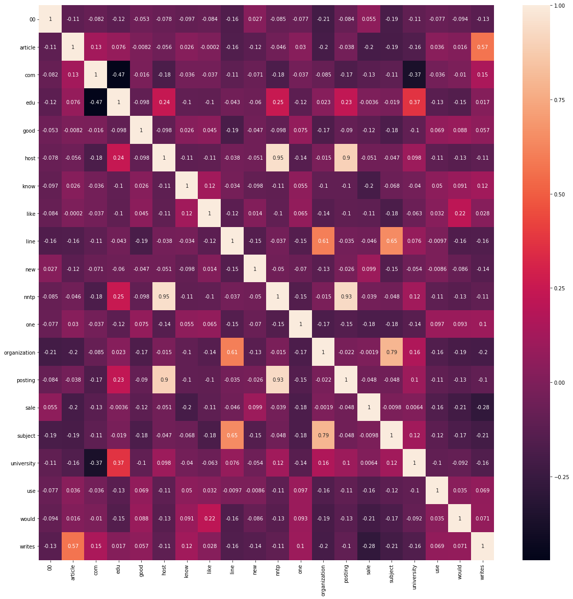
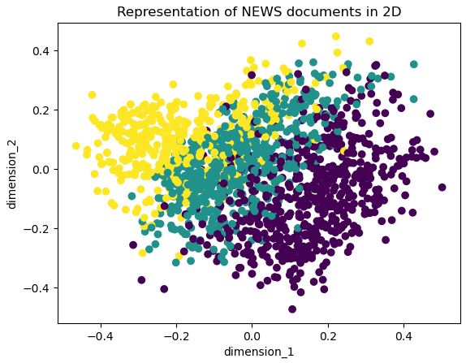
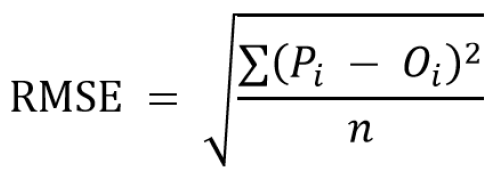
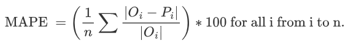

## Ch03.3 Developing a Text Classifier


### 1 相关概念

文本分类器是一种机器学习模型，能够根据文本内容对其进行标注。例如，文本分类器能帮助你判断某条随机文本陈述是否带有讽刺意味。

由于人工处理海量文本数据变得越来越不可行，文本分类器的重要性正日益凸显。


演示文本分类器的构建时，特征提取方案选用的是常见的 `TF-IDF` 表示法。

所谓的特征工程，是将现有特征转化为新特征的艺术。提取能够更有效捕捉 **数据变异性** 的新特征，需要扎实的领域专业知识。


### 2 相关特征的移除

如果特征之间存在相关性，回归模型就会表现欠佳，因此需要对超过指定阈值的特征进行移除（详见 `Exercise35.ipynb`）。

这里用到了 `seaborn` 模块提供了热力图绘制函数：

```python
import seaborn as sns

fig, ax = plt.subplots(figsize=(20, 20))
sns.heatmap(correlation_matrix,annot=True)
fig # 示例代码中缺失了这一行，导致热力图不显示
```

实测效果：



具体移除方法（移除相关系数大于 0.7 的特征）：

```python
import numpy as np
correlation_matrix_ut = correlation_matrix.where(np.triu(np.ones(correlation_matrix.shape)).astype(np.bool))
correlation_matrix_melted = correlation_matrix_ut.stack().reset_index()
correlation_matrix_melted.columns = ['word1', 'word2', 'correlation']
correlation_matrix_melted[(correlation_matrix_melted['word1']!=\
                           correlation_matrix_melted['word2']) & (correlation_matrix_melted['correlation']>.7)]
```

得到结果：

|      | word1        | word2   | correlation |
| ---- | ------------ | ------- | ----------- |
| 95   | host         | nntp    | 0.953828    |
| 98   | host         | posting | 0.896666    |
| 158  | nntp         | posting | 0.934923    |
| 177  | organization | subject | 0.793946    |

因此相关特征为：('host', 'nntp')、('host', 'posting')、('nntp', 'posting')、('organization', 'subject')：

```python
tfidf_df_without_correlated_word = tfidf_df.drop(['nntp', 'posting', 'organization'], axis = 1)
tfidf_df_without_correlated_word.head()
```

至于为什么保留 `subject` 和 `host`，书中并没有说明原因。猜测应该是移除干扰因素即可：移除 `nntp` 后 `host` 保留，但 `posting` 的影响还在，因此移除 `posting`；剩下的 `organization` 和 `subject` 任选一个即可（或者根据具体场景指定移除某一个）。


### 3 降维处理

当文本语料库的 `TF-IDF` 矩阵或词袋表示过于庞大而无法装入内存时，就需要对其进行降维处理，即减少特征矩阵的列数。最常用的降维方法是主成分分析法（principal component analysis，即 `PCA`）。

`PCA` 通过正交变换，将一组可能存在相关性的特征列表转换为线性无关的变量列表。这些线性无关的变量被称为 **主成分（principal components）**。这些主成分按其在数据集中捕获的变异量从大到小排序。

实战：`Exercise36.ipynb`

核心逻辑：

```python
news_data_df['cleaned_text'] = news_data_df['text'].apply(\
lambda x : ' '.join([lemmatizer.lemmatize(word.lower()) \
    for word in word_tokenize(re.sub(r'([^\s\w]|_)+', ' ', str(x))) if word.lower() not in stop_words]))

tfidf_model = TfidfVectorizer(max_features=200)
tfidf_df = pd.DataFrame(tfidf_model.fit_transform(news_data_df['cleaned_text']).todense())
tfidf_df.columns = sorted(tfidf_model.vocabulary_)

from sklearn.decomposition import PCA
pca = PCA(2) # we shall reduce the dimensionality to 2
pca.fit(tfidf_df)

reduced_tfidf = pca.transform(tfidf_df)
reduced_tfidf
'''array([[ 0.25323882, -0.12628741],
       [ 0.23827449, -0.11499837],
       [ 0.21680562,  0.20586702],
       ...,
       [ 0.09441337, -0.15834355],
       [ 0.01107318,  0.09250958],
       [ 0.21506971,  0.19492375]])'''

# 绘图
plt.scatter(reduced_tfidf[:, 0], reduced_tfidf[:, 1], c=news_data_df['category'], cmap='viridis')
plt.xlabel('dimension_1')
plt.ylabel('dimension_2')
plt.title('Representation of NEWS documents in 2D')
plt.show()
```

实测结果：



图中不同的颜色代表不同的类别（标签）。


### 4 确定模型类型

特征集准备就绪后，需确定处理该问题的模型类型：

- 数据未标注时：通常选择无监督模型——
  - 预先设定了聚类数量，则采用 k 均值聚类算法；
  - 否则选择层次聚类；
- 对于标注数据：通常采用监督学习方法——
  - 回归分析：适用于连续型数值，或者当模型输出需为特定类别的发生概率时（用逻辑回归）；
  - 分类分析：适用于离散型或分类型数据；
    - 对于简单分类模型的快速开发：朴素贝叶斯算法
    - 当需要更高精度时：采用更复杂的树形方法（如决策树、随机森林等）


### 5 模型性能的评估

若不进行基准测试，我们便无法确信其运行效果究竟优劣。在未评估模型效率的情况下将其投入生产是不明智的。

主要方法有——

#### 5.1 Confusion Matrix 混淆矩阵

这是一个主要用于评估分类模型性能的二维矩阵。其列包含预测值，行包含实际值。换言之，对于给定的混淆矩阵，它实质是实际值与预测值之间的数据透视表。单元格中的数值表示预测值与实际值匹配的数量以及不匹配的数量。


#### 5.2 Accuracy 准确性

准确率定义为正确分类实例数在总实例数中的比率。使用准确率评估模型时，需要确保数据在类别上保持平衡，即各类别实例数量应 **基本相等**，否则所有实例的预测标签均与出现频率最高的类别标签相同，对应的模型也具有极高的准确率，从而导致失真。


#### 5.3 Precision and Recall 精确率与召回率

通过一个生活实例来理解精确率和召回率。假设母亲让你去查看家里的厨房，找出要补充的物品，然后从市场买回来。你会从市场带回 `P` 件物品，其中只有 `Q` 件是她需要的。比率 `Q/P` 即为精确率。如果母亲期望你带回 `R` 件符合需求的物品，比率 `Q/R` 即为召回率。

```python
Precision = True Positive / (True Positive + False Positive)
Recall = True Positive / (True Positive + False Negative)
```


#### 5.4 F1-score（F1 分数）

F1 分数值，即 **精确率** 与 **召回率** 的调和平均值：

```math
F_1 = \frac{1}{\frac{1}{2}(\frac{1}{P} + \frac{1}{R})} = \frac{2PR}{P + R}
```


#### 5.5 Receiver Operating Characteristic (ROC) Curve 接收者操作特征曲线（ROC 曲线）

要理解 `ROC` 曲线，我们需要先了解真阳率（`TPR`）和假阳率（`FPR`）：

```python
TPR = 真阳性 / (真阳性 + 假阴性)
FPR = 假阳性 / (假阳性 + 真阴性)
```

分类模型的输出可能是概率值。此时，需要设置阈值来将这些概率值转化为类别。`ROC` 曲线是不同阈值下真阳率（`TPR`）与假阳率（`FPR`）的对应关系图。`ROC` 曲线下的面积（Area under the ROC curve，即 `AUROC`）代表模型的有效性，`AUROC` 值越高，模型性能越优。`AUROC` 的最大值为 1。


#### 5.6 Root Mean Square Error (RMSE) 均方根误差

公式如下：



其中，`n` 为样本数量，`Pi` 为第 `i` 个观测值的预测值，`Oi` 为第 `i` 个观测值。


#### 5.7 Maximum Absolute Percentage Error (MAPE) 最大绝对百分比误差（MAPE）

与均方根误差（`RMSE`）类似，这也是评估回归模型性能的另一种方法。其计算公式如下：



其中，`n` 是样本数量，`Pi` 是第 `i` 个观测值的预测值（即预报值），`Oi` 是第 `i` 个观测值（即实际值）。

`RMSE` 和 `MAPE` 实战：`Exercise37.ipynb`


### 6 文本分类实战

详见 `Activity5.ipynb`。该实战为多种机器学习算法创建了一个通用函数：

```python
def clf_model(model_type, X_train, y_train, X_valid):
    # 训练模型
    model = model_type.fit(X_train,y_train)
    # 预测
    predicted_labels = model.predict(X_valid)
    predicted_probab = model.predict_proba(X_valid)[:,1]
    return [predicted_labels,predicted_probab, model]

def model_evaluation(actual_values, predicted_values, predicted_probabilities):
    # 计算评价指标：
    cfn_mat = confusion_matrix(actual_values,predicted_values)
    print("confusion matrix: \n",cfn_mat)
    print("\naccuracy: ",accuracy_score(actual_values,predicted_values))
    print("\nclassification report: \n", classification_report(actual_values,predicted_values))
    fpr,tpr,threshold=roc_curve(actual_values, predicted_probabilities)
    print ('\nArea under ROC curve for validation set:', auc(fpr,tpr))
    # 绘制 ROC 曲线：
    fig, ax = plt.subplots(figsize=(6,6))
    ax.plot(fpr,tpr,label='Validation set AUC')
    plt.xlabel('False Positive Rate')
    plt.ylabel('True Positive Rate')
    ax.legend(loc='best')
    plt.show()
```

开发端到端的文本分类器分为多个阶段：

- 首先对文本语料库进行清洗和分词处理；
- 运用 `TF-IDF` 方法提取特征；
- 随后将数据集划分为训练集和验证集；
- 通过逻辑回归、随机森林和 `XGBoost` 等多种机器学习算法构建分类模型。
- 最终通过混淆矩阵、准确率、精确率、召回率、`F1` 得分及 `ROC` 曲线等指标评估模型性能。


