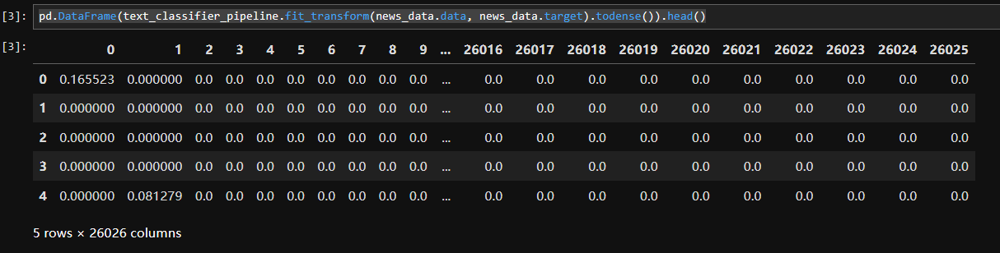

## Ch03.4 Building Pipelines for NLP Projects


### 为 NLP 项目构建管道

通常，管道指的是能够实现空气、水流或类似物质 **高效流动的结构**。在此语境下，管道具有相似的含义——它有助于优化 `NLP` 项目的各个阶段。

`NLP` 项目通常分多个阶段进行，例如分词、词干提取、特征提取（生成 `TF-IDF` 矩阵）以及模型构建等。我们并非将每个阶段单独执行，而是创建一个包含所有阶段的 **有序列表**，该列表被称为 **处理管道（pipeline）**。

接下来我们将通过管道解决一个文本分类问题：开发一个处理管道，使得 `sklearn` 的【20 类新闻组文本数据集】能够直接构建出对应的 `TF-IDF` 矩阵表示：

```python
from sklearn.pipeline import Pipeline
from sklearn.feature_extraction.text import TfidfTransformer
from sklearn import tree
from sklearn.datasets import fetch_20newsgroups
from sklearn.feature_extraction.text import CountVectorizer
import pandas as pd

categories = ['misc.forsale', 'sci.electronics', 'talk.religion.misc']

news_data = fetch_20newsgroups(subset='train', categories=categories, shuffle=True, random_state=42, download_if_missing=True)


text_classifier_pipeline = Pipeline([('vect', CountVectorizer()), \
                                     ('tfidf', TfidfTransformer())])
text_classifier_pipeline.fit(news_data.data, news_data.target) 

pd.DataFrame(text_classifier_pipeline.fit_transform(news_data.data, news_data.target).todense()).head()
```

实测效果：




